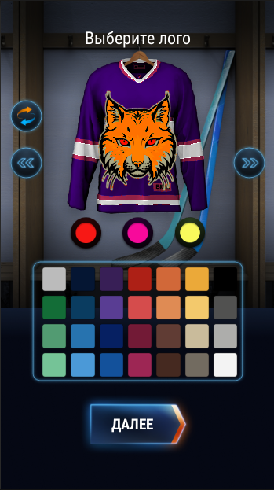

Реализовано изменение цвета с помощью шейдеров. У формы цвет меняются в 3ех частях в зависимости от нажатия центральных кнопок и выбора цвета из палитры. Если часть для изменения не выбрана, то меняется основной цвет (при похожих оттенках цвета частей могут сливаться).
Рандомная генерация подбирает цвета для всех 3 частей как для формы, так и для лого.
Таким же образом реализовано  изменение 3ех цветов логотипа.
Центральные кнопки отображают цвета своих частей.  
Экран названия команды сохраняет цвета материалов, которые прикриплены к объекту Image.
По нажатию кнопки Далее происходит сохранение цветов всех 3 частей формы, лого и названия команды через PlayerPrefs, если в поле ввода не более 10 символов. В ином случае текст подсвечивается, кнопка тухнет и ввод не активен.

    
    
Изменение цветов формы

    
    
Изменение основного цвета Logo

    
    
Экран ввода имени команды

