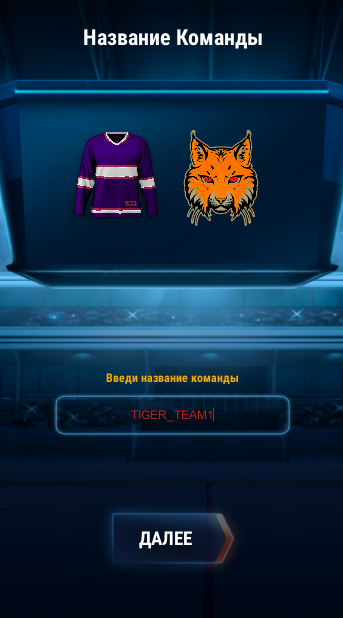

Реализовано изменение цвета с помощью шейдеров. У формы цвет меняются 3 части в зависимости от нажатия 3 центральных кнопок и выбора цвета из палитры. Рандомная генерация работает только для основной части (наибольшее покрытие). 
Таким же образом реализовано  изменение основного цвета логотипа. У логотипа доступен для изменения основной цвет, рандомная генерация присутствует.
Экран названия команды сохраняет только цвета тех шейдеров, материалы которых прикриплены к объекту Image, в данном случае это основные цвета. Это поправить можно переписав шейдер на 3 цвета и закрепив в материале Image, вместо MeshRender.
По нажатию кнопки далее происходит сохранение осевных цветов материала и названия команды через PlayerPrefs.

    
    
Изменение основного цвета с помощью палитры и зелёной кнопки

    
    
Изменение основного цвета Logo

    
    
Экран ввода имени команды

